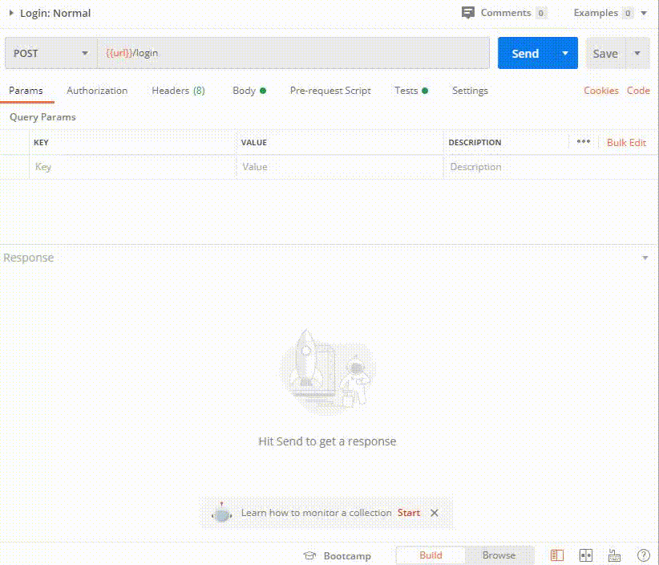
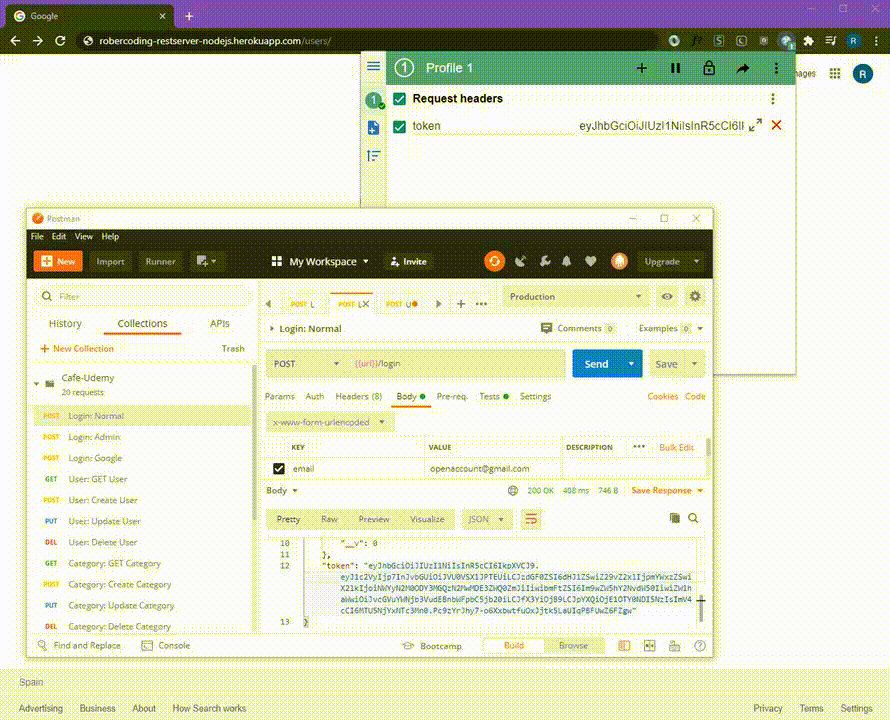

# Rest Server built with Node.js

I've built this project as a way to get out of my comfort zone and improve myself in different situation that I'm not used to.

#### For a brief, you have the postman documentation where it shows all the requests that are avaliable and the production webpage:

[Postman documentation](https://documenter.getpostman.com/view/11964320/T1Djjz7Z?version=latest)

[Production WebPage](https://robercoding-restserver-node.herokuapp.com) <i>It may take a few seconds to start the server</i>

In order to be avaliable to access to the requests you'll have to login an account and get the token generated on the response. <i>(Token expires every 8760h)</i>

##### Account details:
email: openaccount@gmail.com

password: openaccount

<b>Then in the postman app you'll send the details in the body and it will return the token</b>

<i>/login</i>

<b> Now you can access to all the requests methods that are avaliable for <i>USER_ROLE</i></b>

Example: GET request with <i>/users</i>

